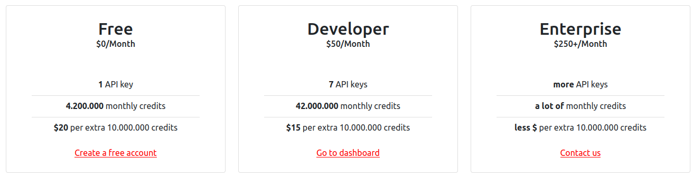

# Pricing

<figure><figcaption>
Current price, as reflected by our landing page
</figcaption></figure>

We're constantly striving to offer the greatest possible value to the Chia community. With that in mind, we created 3 tiers for different types of customers:

* **Free:** This plan is intended for projects that are just starting out or require a low number of interactions with our services. This category also includes the 'No Card' plan - it has the same specifications as the Free plan, except that extra credits cannot be purchased. It is also a great way to test our services without making any commitments.
* **Developer:** For teams of all sizes that require some interactions with our service. Maybe they're developing a dApp that got really popular. Or maybe they are indexing the Chia blockchain. Whatever it is, we've got them covered.
* **Enterprise:** For teams that require a lot of interactions with the services that we offer. At this scale, we are more than surely going to increase the number of stand-by nodes in our cluster. Creating and managing an organization-specific cluster is also an option.

## Current Prices

We want to make pricing as predictable and transparent as possible. With that in mind, please find the current price table [here](https://github.com/fireacademy/prices). It is important to keep in mind that it might change as we optimize our infrastructure or discover bottlenecks.
